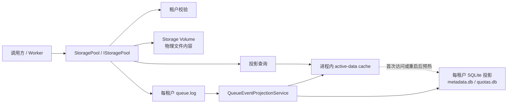
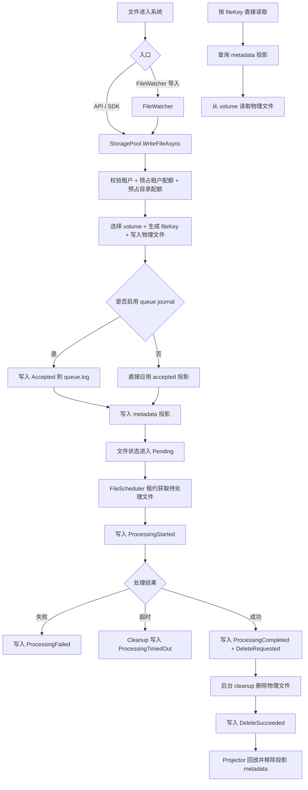
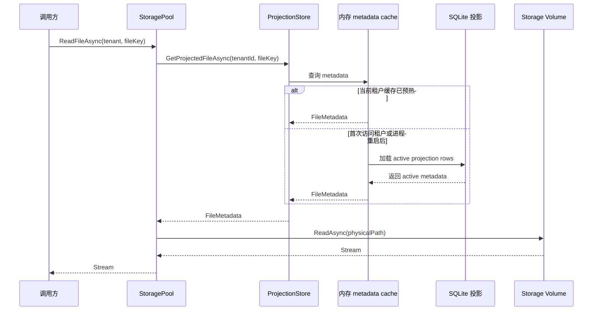
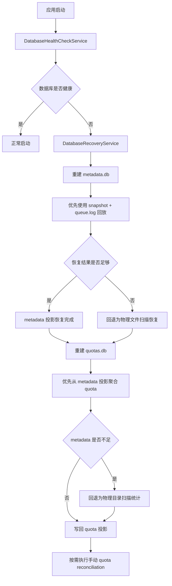

# Locus 存储全生命周期说明

## 文档目的

这篇文档用于说明 Locus 在 durable queue 重构之后的完整文件生命周期。

它覆盖以下内容：

- 文件如何进入系统并写入存储
- 文件如何被直接读取或被调度处理
- 文件处理成功、失败、超时后的流转方式
- 文件何时进入删除阶段，以及删除如何完成
- `queue.log`、SQLite、内存缓存、物理文件各自承担什么职责
- SQLite 损坏、投影丢失、进程异常中断时系统如何恢复

## 核心状态层

当前 Locus 可以理解为由四层状态共同组成：

1. 物理文件层
   - 文件真实内容保存在各个挂载的 storage volume 上。
   - 这是文件字节内容的最终载体。

2. durable queue 日志层
   - 每个租户有自己的 `queue.log`。
   - 它以追加方式记录队列状态迁移事件。
   - 这是队列状态机的持久事实来源。

3. SQLite 投影层
   - `metadata.db`：保存文件当前投影状态
   - `quotas.db`：保存租户和逻辑目录的配额投影状态
   - 它们是本地可查询、可恢复的投影，不再是唯一真相来源。

4. 进程内内存层
   - 热路径读写、调度、配额判断优先依赖内存缓存和索引。
   - SQLite 主要承担持久化投影和重启恢复的职责。

## 正式架构图

### 架构职责定义

- `Storage Volume` 保存文件真实字节内容，是文件内容的最终载体。
- `queue.log` 保存队列状态迁移事件，是队列状态机的持久事实来源。
- SQLite 保存可查询、可重建的本地投影，不负责承载文件二进制内容。
- 进程内内存缓存承担热路径查询与调度加速，当前进程内优先命中它。

## 队列事件类型

当前 `queue.log` 中会记录这些事件：

- `Accepted`
- `ProcessingStarted`
- `ProcessingFailed`
- `ProcessingTimedOut`
- `ProcessingCompleted`
- `DeleteRequested`
- `DeleteSucceeded`

这些事件会被 `QueueEventProjectionService` 持续回放，并投影到 metadata / quota / snapshot。

## 全局流程图

## 一、文件写入流程

### 入口

文件进入系统主要有两种方式：

1. 调用方直接通过 `StoragePool.WriteFileAsync(...)` 写入
2. `FileWatcher` 扫描到目录中的文件后自动导入，最终也会调用 `StoragePool.WriteFileAsync(...)`

### 详细步骤

1. 校验租户
   - 系统先确认租户存在且处于启用状态。
   - 禁用租户不会进入后续写入流程。

2. 预占配额
   - 先预占租户级配额
   - 再规范化逻辑目录路径
   - 然后预占目录级配额

3. 选择存储卷
   - 从健康的 volume 中选择一个可写卷
   - 生成 `fileKey`
   - 如果传入了原始文件名，则保留文件扩展名

4. 写入物理文件
   - 文件内容首先真正写入 volume 上的物理路径
   - 这一步先于 metadata 持久化

5. 构造初始 metadata
   - 新文件会生成一条 `Pending` 状态的 metadata
   - 里面包含：
     - `TenantId`
     - `FileKey`
     - `VolumeId`
     - `PhysicalPath`
     - `DirectoryPath`
     - `FileSize`
     - `CreatedAt`
     - `RetryCount`
     - `OriginalFileName`
     - `FileExtension`

6. 写入 durable accepted 语义
   - 如果启用了 queue journal：
     - 会先往 `queue.log` 里追加 `Accepted`
   - 如果没有启用 journal 且显式允许 legacy 模式：
     - 会直接应用 accepted 配额投影

7. 写入投影
   - metadata 会进入投影存储
   - 当前实现是“先更新内存，再异步写 SQLite”

### 关键保证

- 物理文件一定先于 metadata 投影写入
- durable journal 模式下，系统会尽量保证“物理文件写入成功”和“Accepted 事件写入成功”同时成立
- 如果物理文件写入成功了，但 `Accepted` 没能完成，系统会尽量删除刚写入的物理文件并回滚预占配额
- 如果 SQLite 暂时不可用，物理文件仍然是安全的，后续可以通过 orphan recovery 补回 metadata

## 二、直接读取流程

这里说的“读取”，指的是按 `fileKey` 直接获取文件内容，不是队列式调度消费。

### 读取链路正式图

### 正式结论

- 直接读取文件内容时，不会从 SQLite 读取文件字节。
- 读取动作先根据 `(tenantId, fileKey)` 查询 metadata 投影，再按 `PhysicalPath` 去 volume 打开物理文件。
- 在当前进程内，metadata 查询优先命中内存缓存。
- SQLite 的职责是投影持久化与重启恢复，而不是文件内容存储。

### 步骤

1. 校验租户状态
2. 根据 `(tenantId, fileKey)` 查询当前 metadata 投影
3. 校验 metadata 所属租户
4. 根据 `VolumeId` 找到已挂载的 volume
5. 使用 `volume.ReadAsync(...)` 打开物理文件流

### 特点

- 直接读取不会往 `queue.log` 追加事件
- 它依赖 metadata 投影来定位文件的物理路径
- 它本质上是“投影查定位，物理文件读内容”

## 三、队列式读取 / 处理流程

这条链路用于“消费者线程从池子里取文件进行处理”，不是直接返回文件内容，而是先拿到一个处理租约。

### 获取待处理文件

1. `FileScheduler` 从投影中原子获取一个 `Pending` 文件
2. 该文件被标记为 `Processing`
3. 系统追加 `ProcessingStarted` 到 `queue.log`
4. 返回 `FileLocation`

`FileLocation` 中包含：

- `TenantId`
- `FileKey`
- `VolumeId`
- `PhysicalPath`
- `DirectoryPath`
- `ProcessingStartTime`
- `Lease`

调用方随后根据这个位置自行读取物理文件内容。

### 处理成功

1. 调用方处理完文件
2. 调用 `MarkAsCompletedAsync(lease)`
3. 系统写入：
   - `ProcessingCompleted`
   - `DeleteRequested`
4. 文件进入“已完成，等待删除”的阶段
5. 真正删除物理文件不在工作线程里进行，而交给后台 cleanup

### 处理失败

1. 调用 `MarkAsFailedAsync(lease, error)`
2. 系统写入 `ProcessingFailed`
3. `RetryCount` 增加
4. 如果未超过最大重试次数：
   - 状态重新回到 `Pending`
   - 设置 `AvailableForProcessingAt`
   - 等待延迟后重试
5. 如果达到最大重试次数：
   - 状态进入 `PermanentlyFailed`

### 处理超时

1. 后台 cleanup 发现某个文件长时间停留在 `Processing`
2. 系统写入 `ProcessingTimedOut`
3. 文件被重置回 `Pending`
4. 这不是普通失败，不会伪造成一次 `ProcessingFailed`

## 四、完成后的删除流程

当前实现中，文件“处理完成”并不等于“立刻从磁盘删除”。

删除是一个独立的、可恢复的阶段。

### 步骤

1. 工作线程处理成功
2. 写入 `ProcessingCompleted`
3. 写入 `DeleteRequested`
4. 后台 cleanup 在后续周期中选中这批可删除文件
5. 实际删除物理文件
6. 删除成功后写入 `DeleteSucceeded`
7. projector 回放 `DeleteSucceeded`
8. 回放逻辑完成：
   - 扣减目录配额
   - 扣减租户配额
   - 移除 metadata 投影

### 意义

这种两阶段删除设计有几个好处：

- 不把物理删除放在处理热路径中
- 删除过程具备 durable event 记录
- 删除失败或中断时，可以继续恢复和补偿

## 五、永久失败文件清理流程

对于已经进入 `PermanentlyFailed` 的文件，后台 cleanup 也会在保留期之后进行最终清理。

在 journal 模式下，这条链路也会走 durable delete 流程。

### 步骤

1. cleanup 选出达到保留时间的 `PermanentlyFailed` 文件
2. 删除物理文件
3. 写入：
   - `DeleteRequested`
   - `DeleteSucceeded`
4. 通过投影侧移除 metadata，并更新 quota

也就是说，永久失败文件的最终删除，不再是一个完全绕开队列语义的特殊路径。

## 六、QueueEventProjectionService 的作用

`QueueEventProjectionService` 是 durable queue 架构里非常关键的一层。

### 它负责的事

- 从 `queue.log` 读取每个租户的事件批次
- 逐条回放到 metadata 投影
- 根据 accepted / delete 事件更新 quota 投影
- 保存 projector cursor
- 自动保存 projection snapshot
- 在 projector 追平日志尾部且达到阈值时执行 journal compaction

### 这意味着什么

`queue.log` 并不是只在写入时记一笔，而是会持续驱动整个队列状态机的恢复和投影构建。
在当前默认配置下，compaction 处于开启状态，因此日志不会无限增长；当某个租户的
projector 已经追到日志尾部，且已处理字节数达到 `MinBytesBeforeCompaction` 阈值后，
前面已经完成投影的日志段会被裁剪。

## 七、SQLite 现在还有什么作用

SQLite 现在依然非常重要，但它的角色已经从“唯一真相数据库”转成了“核心投影数据库”。

## `metadata.db`

`metadata.db` 负责保存文件当前投影状态，例如：

- `Pending`
- `Processing`
- `Completed`
- `DeleteRequested`
- `DeleteSucceeded`
- `PermanentlyFailed`

它用于：

- direct read 时定位 `PhysicalPath`
- scheduler 取下一个待处理文件
- 状态迁移更新
- cleanup 查询
- 启动恢复和重建

## `quotas.db`

`quotas.db` 保存：

- 逻辑目录级配额当前计数
- 目录级限制
- 租户级配额当前计数
- 全局 quota 配置

### 结论

SQLite 的作用依然很大，但它不再是系统中唯一不可替代的真相来源。

可以这样理解：

- 文件内容真相：物理文件
- 队列状态真相：`queue.log`
- 当前查询和调度视图：SQLite 投影

## 八、metadata / quota 为什么还能重建

因为 Locus 当前设计把“内容”和“状态迁移”分开保存了：

- 内容存在 volume 上
- 状态迁移存在 `queue.log`
- 当前可查询形态存在 SQLite 投影

所以只要物理文件和 durable queue 还在，投影层就不是不可恢复的。

## 九、orphan file 恢复

所谓 orphan file，指的是：

- 物理文件真实存在
- 但是 metadata 投影丢失了

这种情况常见于：

- 物理文件写完后，进程在 metadata 异步落盘前崩溃
- SQLite 暂时不可写
- metadata write-behind 队列尚未 flush 就退出

### 恢复机制

`OrphanFileRecoveryService` 会周期性执行恢复。

它内部调用 `StorageCleanupService.RecoverAllOrphanedFilesAsync(...)`，流程如下：

1. 按租户、按 volume 扫描物理文件
2. 检查该物理路径是否已经在 metadata 投影中存在
3. 如果不存在，则根据路径重建 metadata
4. 重新应用 accepted 配额投影
5. 把文件重新以 `Pending` 状态放回队列

### 关键点

- orphan file 不会被直接删除
- 它会被恢复成一个可重新处理的正常文件

## 十、orphaned metadata 清理

和 orphan file 相反，还有另一种不一致：

- metadata 还在
- 物理文件已经没了

这种 stale metadata 会由后台 cleanup 清理掉。

### 步骤

1. `BackgroundCleanupService` 调用 scheduler 的 orphaned metadata cleanup
2. 系统确认物理文件确实不存在
3. 移除 metadata 投影
4. 扣减对应的 tenant / directory quota

这条路径用于补齐“物理文件已经消失，但投影还没清掉”的异常状态。

## 十一、SQLite 损坏时如何恢复

数据库损坏恢复由两个服务协同完成：

- `DatabaseHealthCheckService`
- `DatabaseRecoveryService`

## 启动时健康检查

应用启动时，`DatabaseHealthCheckService` 会：

1. 等待其他服务初始化完成
2. 检查所有租户的 `metadata.db` 和 `quotas.db`
3. 识别损坏数据库
4. 在配置允许时自动触发恢复

## metadata.db 重建顺序

当某个租户的 `metadata.db` 损坏时，恢复顺序如下：

1. 获取该租户的独占 rebuild 锁
2. 备份损坏数据库文件
3. 优先尝试从 snapshot + `queue.log` 回放恢复 metadata
4. 如果 queue-based recovery 不足以恢复：
   - 回退到扫描物理文件
   - 重新构造 metadata
   - 状态统一按 `Pending` 恢复

### queue-based 恢复的意义

如果 durable queue 是完整的，那么 metadata 投影可以不依赖旧 SQLite，直接从日志重建。

## quotas.db 重建顺序

当某个租户的 `quotas.db` 损坏时，恢复顺序如下：

1. 获取该租户的独占 rebuild 锁
2. 备份损坏数据库文件
3. 优先从当前 metadata 投影聚合出目录和租户计数
4. 如果 metadata 为空且 queue 可用：
   - 先尝试通过 queue 恢复 metadata
5. 如果 metadata 仍然不可用：
   - 回退到扫描物理目录统计文件数量
6. 如需修复 quota 漂移，可在维护窗口显式执行 quota reconciliation

## 恢复流程图

## 十二、进程崩溃但数据库没坏，怎么补偿

这和“SQLite 损坏”不是一回事。

这种场景通常是：

- 物理文件已经写成功
- 但 metadata 还没完全 flush 到 SQLite
- 进程突然退出

这时数据库文件本身不一定坏，但投影可能不完整。

### 解决方式

系统通过两条补偿链路处理：

1. orphan file recovery
   - 修复“磁盘上有文件，但 metadata 没了”

2. orphaned metadata cleanup
   - 修复“metadata 还在，但磁盘文件没了”

也就是说，Locus 当前不只考虑“数据库损坏怎么恢复”，还考虑“投影不一致怎么自动收敛”。

## 十三、后台服务总览

### `QueueEventProjectionService`

- 回放 `queue.log`
- 更新 metadata / quota 投影
- 维护 cursor
- 保存 snapshot
- 可选压缩 journal

### `BackgroundCleanupService`

- 清理已完成文件
- 回收处理超时文件
- 清理永久失败文件
- 清理失效 metadata
- 删除损坏数据库遗留备份文件
- 优化 SQLite 文件空间

### `OrphanFileRecoveryService`

- 扫描没有 metadata 的物理文件
- 重建 metadata
- 把文件放回 `Pending`

### `DatabaseHealthCheckService`

- 启动时检查 SQLite 是否损坏
- 必要时自动触发重建

## 十四、推荐的整体理解方式

理解当前 Locus 架构时，最推荐用下面这套心智模型：

- 物理文件层负责保存真实内容
- `queue.log` 负责保存队列状态迁移事实
- SQLite 负责保存当前可查询、可调度、可恢复的投影
- 内存层负责让热路径足够快

换句话说：

- 内容真相在 volume
- 队列真相在 `queue.log`
- 当前运行视图在 projection

## 十五、补充说明

- direct read 依赖 metadata 投影来定位物理文件
- 处理成功后并不会立刻删除文件，而是进入独立的 durable delete 阶段
- 进程崩溃可能导致内存投影丢失，但 orphan recovery 和 queue replay 会帮助系统收敛
- SQLite 仍然非常重要，只是它的定位已经从“唯一真相”转成了“核心投影层”
